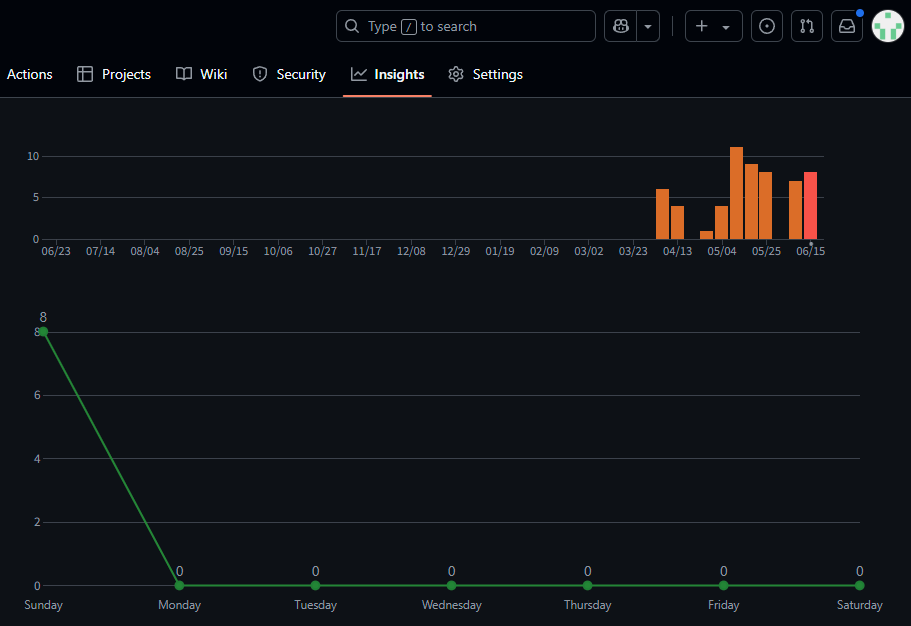
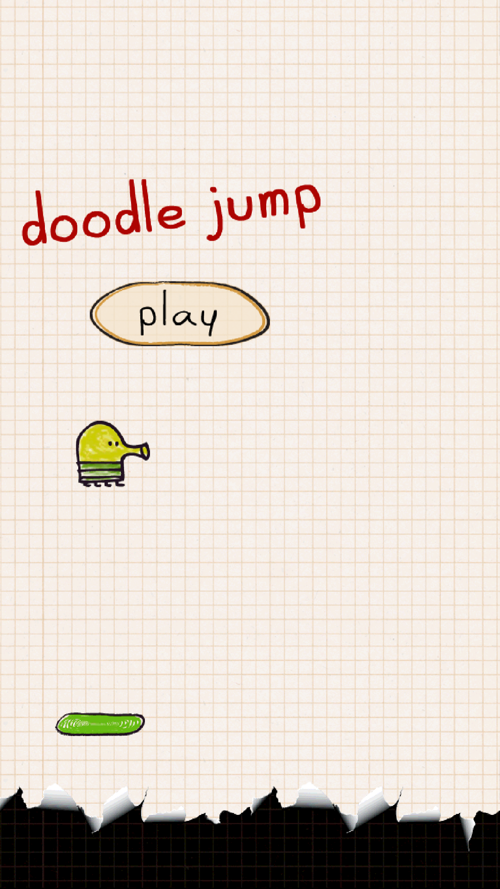
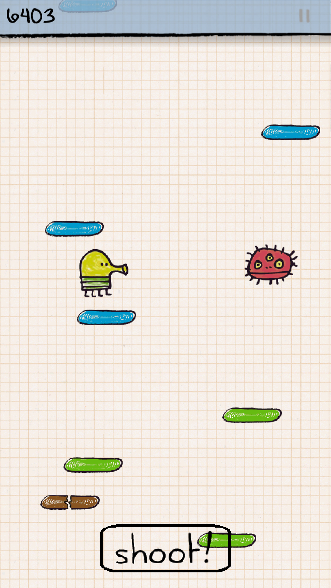
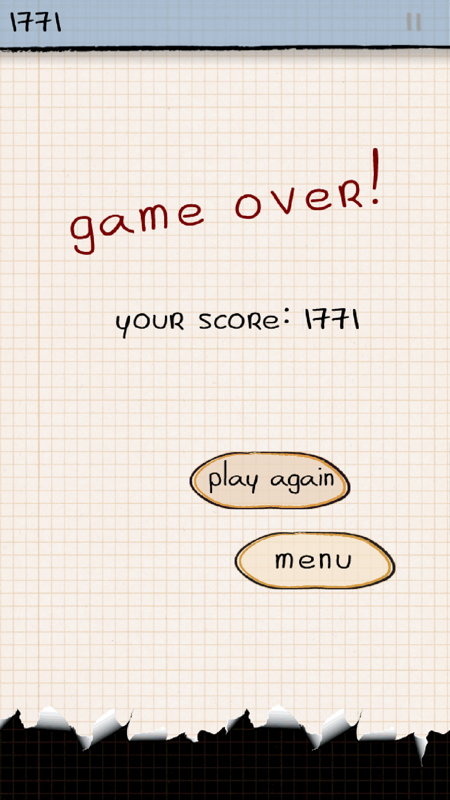
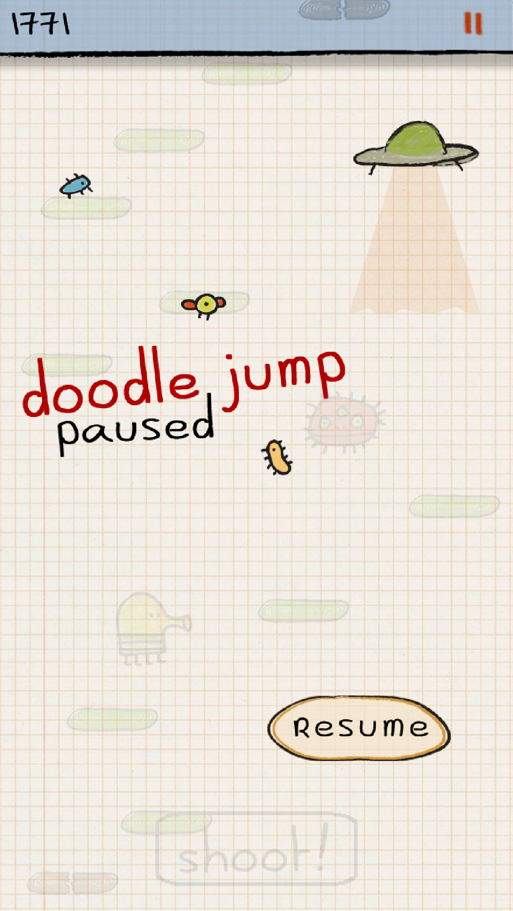
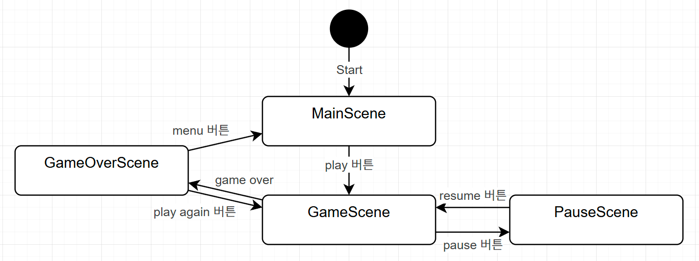
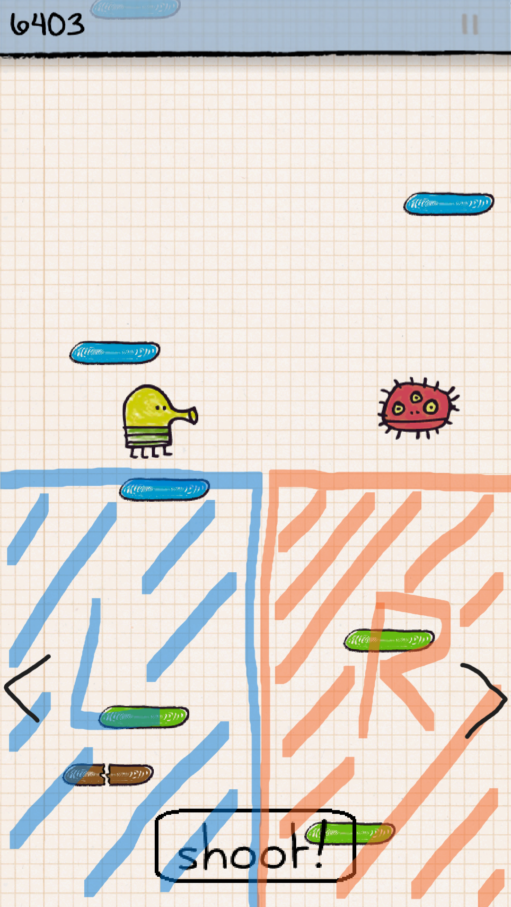
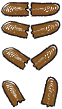

# Doodle Jump

## 개발계획

### 개요
아래로 떨어지지 않도록 하며 발판을 밟고 최대한 높이 올라가는것이 목표인 게임이다. 사용자가 조작하는 캐릭터는 발판이나 몬스터를 밟으면 자동으로 점프하며, 몬스터에 부딪치거나 아래로 떨어지면 게임오버된다. 발판 위에는 올라가는데 도움을 주는 아이템이 나올때도 있다. 발로 밟거나 콩알탄을 발사해서 몬스터를 처치할 수 있다.

 

### 게임 흐름
게임이 시작되면 발판, 몬스터, 아이템이 랜덤하게 생성되고 사용자는 캐릭터를 조작해서 발판을 밟으며 올라간다.  
높이 올라갈수록 발판이 움직이거나, 부서져서 밟기 어렵게 되고 몬스터도 자주 등장한다.  

### 게임 화면
| 게임화면1(아이템) | 게임화면2(몬스터) | 게임화면3(공격) |
| :---: | :---: | :---: |
|  |  |  |

 

### 개발 범위
- 캐릭터 조작(이동, 공격)
- 발판, 몬스터, 아이템 랜덤생성
- 충돌처리
- 아이템 효과 구현
- 애니메이션
- 점수계산
- 효과음 출력
- 일시정지
- 게임오버 처리
- 기록저장 및 불러오기

 

### 개발 현황
개발기간: 8주(2025/04/07~)

| 주차 | 내용 | 진행도 | 상세 |
| :---: | :---: | :---: | --- |
| 1주차 | 캐릭터가 발판 위에서 점프 | 100% | |
| 2주차 | 캐릭터 조작 / 충돌처리 | 100% | |
| 3주차 | 캐릭터 애니메이션 | 100% | |
| 4주차 | 아이템 효과 구현 / 아이템 애니메이션 | 100% | |
| 5주차 | 발판, 몬스터, 아이템 랜덤생성 / 점수계산 | 80% | 몬스터 구현 미흡 |
| 6주차 | 게임오버 처리 / 일시정지 | 100% | |
| 7주차 | 기록저장 및 불러오기 | 0% | 구현 안됨 |
| 8주차 | 효과음 추가 / 최종점검 | 100% | |

| 이동/점프 | 발판/아이템 | 랜덤생성(4배속) |
| :---: | :---: | :---: |
|  |  |  |

| 부스터 아이템 | 몬스터 | 게임오버 |
| :---: | :---: | :---: |
|  |  |  |

 

| 주차 | 커밋 횟수 |
| :---: | :---: | 
| 1주차 | 6 |
| 2주차 | 4 |
| 3주차 | 0 |
| 4주차 | 1 |
| 5주차 | 4 |
| 6주차 | 11 |
| 7주차 | 9 |
| 8주차 | 8 |
| 9주차 | 0 |
| 10주차 | 7 |
| 11주차 | 8 |

 

### 인터페이스
| 메인화면 | 게임화면 | 게임오버화면 | 정지화면 |
| :---: | :---: | :---: | :---: |
|  |  |  |  |

#### 메인화면
- play버튼을 누르면 게임화면으로 이동

#### 게임화면
- 화면의 아래 절반 터치시 좌/우 이동
- 화면 아래에 공격버튼 배치
- 상단에 점수와 정지 버튼 배치

#### 정지화면
- 상단에 점수 표시
- resume 버튼을 누르면 게임화면으로 이동

#### 게임오버화면
- 현재 점수 표시
- play again 버튼을 누르면 게임화면으로 이동
- menu 버튼을 누르면 메인화면으로 이동

#### 기록화면
구현되지 않음

 

- - -

 

### GameObject

| 이름 | 설명 | 이미지 |
| :---: | :--- | :---: |
| `Player` | <li>플레이어 캐릭터 애니메이션</li><li>발판을 밟으면 점프한다</li><li>아이템에 닿으면 즉시 사용한다</li> |  |
| `Tile` | <li>플레이어가 밟고 올라갈 수 있는 오브젝트</li><li>발판 생성시 필요한 상수 정의(최대/최소 x좌표 등)</li><li>아이템을 자식으로 가질 수 있다</li> | |
| `NormalTile` | <li>부모클래스: `Tile`</li><li>고정된 발판</li> |  |
| `MovingTile` | <li>부모클래스: `Tile`</li><li>화면 양 끝을 좌우로 왕복하는 발판</li> |  |
| `BrokenTile` | <li>부모클래스: `Tile`</li><li>밟으면 부서지는 발판</li><li>부서지는 애니메이션</li> |  |
| `MapLoader` | <li>타일/아이템/몬스터 생성(올라가지 못하는 패턴이 생기지 않도록 구현)</li> | |
| `Item` | <li>플레이어가 위로 올라가는데 도움을 주는 오브젝트</li><li>한번 사용하면 비활성화됨</li><li>발판 위에 생성됨</li> | |
| `Spring` | <li>부모클래스: `Item`</li><li>플레이어가 밟으면 더 높이 점프한다</li><li>튕기는 애니메이션</li> |  |
| `Propeller` | <li>부모클래스: `Item`</li><li>일정시간동안 빠르게 올라간다</li><li>발동중엔 무적상태가 된다</li><li>프로펠러 애니메이션</li> |  |
| `Jetpack` | <li>부모클래스: `Item`</li><li>일정시간동안 빠르게 올라간다</li><li>발동중엔 무적상태가 된다</li><li>제트팩 애니메이션</li> |  |
| `Monster` | <li>플레이어가 충돌시 게임오버된다</li><li>플레이어가 밟으면 처치된다</li><li>플레이어가 콩알탄을 맞추면 처치된다</li></li> |  |
| `InGameScene` | <li>InGame 상수 정의(중력상수 등)</li><li>충돌처리</li><li>점수계산</li> | |

 

### 사용된 기술
수업내용 참고
- Pool/객체 재활용
- 레이어
- 스코어 출력
- 버튼
- VertScroll BG
- Multiple Scene / Transparent Scene
- Sound

직접개발
- CCD
- FSM

 
 

### 부족한점
- 몬스터 Path
- 기록저장/불러오기
- 화면의 빈 부분 처리

#### 출시한다면
- 장애물
- 애니메이션
- 글로벌 순위표

### 수업후기
다른 수업들이 3D 위주라서 소홀했던 2D게임에서 자주 사용되는 기법들을 배우는것을 기대했는데,
깃헙에 샘플 프로그램을 단계별 커밋까지 나눠서 올려주셔서 기대했던 내용들을 습득하는데 큰 도움이 되었습니다.  
아쉬웠던 점은, 안드로이드가 코틀린을 밀어주고있는데 자바 대신 코틀린을 썼다면 더 좋았을거같습니다.
최신 언어의 문법과 구조를 훑어보는것도 좋았을것 같습니다.

 
 
 
 
 

- - -

 
 
 
 
 

[요구사항](요구사항.md)