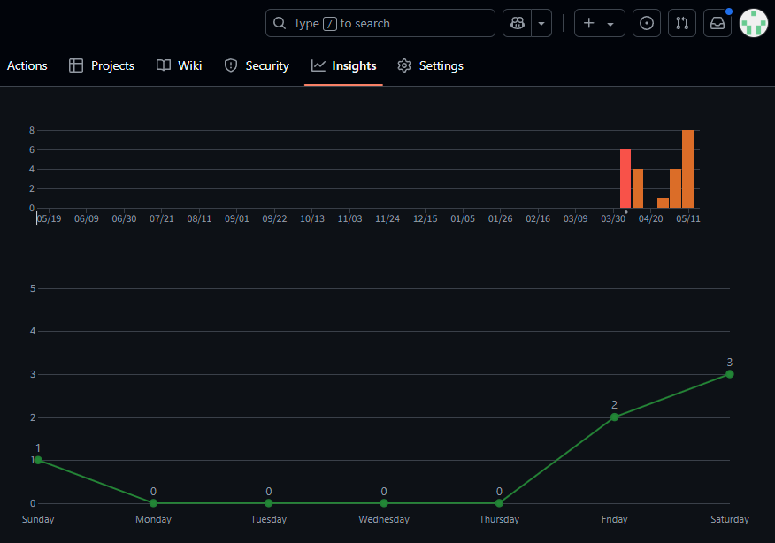

# Doodle Jump

## 개발계획

### 개요
아래로 떨어지지 않도록 하며 발판을 밟고 최대한 높이 올라가는것이 목표인 게임이다. 사용자가 조작하는 캐릭터는 발판이나 몬스터를 밟으면 자동으로 점프하며, 몬스터에 부딪치거나 아래로 떨어지면 게임오버된다. 발판 위에는 올라가는데 도움을 주는 아이템이 나올때도 있다. 발로 밟거나 콩알탄을 발사해서 몬스터를 처치할 수 있다.

 

### 게임 흐름
게임이 시작되면 발판, 몬스터, 아이템이 랜덤하게 생성되고 사용자는 캐릭터를 조작해서 발판을 밟으며 올라간다.  
높이 올라갈수록 발판이 움직이거나, 부서져서 밟기 어렵게 되고 몬스터도 자주 등장한다.  

### 게임 화면
| 게임화면1(아이템) | 게임화면2(몬스터) | 게임화면3(공격) |
| :---: | :---: | :---: |
|  |  |  |

### 개발 범위
- 캐릭터 조작(이동, 공격)
- 발판, 몬스터, 아이템 랜덤생성
- 충돌처리
- 아이템 효과 구현
- 애니메이션
- 점수계산
- 일시정지
- 게임오버 처리
- 기록저장 및 불러오기

 

### 개발 현황
개발기간: 8주(2025/04/07~)

| 주차 | 내용 | 진행도 | 상세 |
| :---: | :---: | :---: | --- |
| 1주차 | 캐릭터가 발판 위에서 점프 | 100% | |
| 2주차 | 캐릭터 조작 / 충돌처리 | 80% | 이동 버튼 대신 화면 좌우 터치로 이동중, 아직 총알을 발사하지 않음 |
| 3주차 | 캐릭터 애니메이션 | 80% | 공격 애니메이션이 없음 |
| 4주차 | 아이템 효과 구현 / 아이템 애니메이션 | 20% | 스프링만 구현됨 |
| 5주차 | 발판, 몬스터, 아이템 랜덤생성 / 점수계산 | 50% | 몬스터와 일부 아이템은 구현되지 않음 |
| 6주차 | 게임오버 처리 / 일시정지 | 0% | |
| 7주차 | 기록저장 및 불러오기 | 0% | |
| 8주차 | 효과음 추가 / 최종점검 | 0% | |

| 이동/점프 | 발판/아이템 | 발판랜덤생성(4배속) |
| :---: | :---: | :---: |
|  |  |  |

| 주차 | 커밋 횟수 |
| :---: | :---: | 
| 1주차 | 6 |
| 2주차 | 4 |
| 3주차 | 0 |
| 4주차 | 1 |
| 5주차 | 4 |
| 6주차 | 8 |
| 7주차 | - |
| 8주차 | - |

 

### GameObject

| 이름 | 설명 | 이미지 |
| :---: | :--- | :---: |
| `Player` | <li>플레이어 캐릭터 애니메이션</li><li>발판을 밟으면 점프한다</li><li>아이템에 닿으면 즉시 사용한다</li> |  |
| `Tile` | <li>플레이어가 밟고 올라갈 수 있는 오브젝트</li><li>발판 생성시 필요한 상수 정의(최대/최소 x좌표 등)</li><li>아이템을 자식으로 가질 수 있다</li> | |
| `NormalTile` | <li>부모클래스: `Tile`</li><li>고정된 발판</li> |  |
| `MovingTile` | <li>부모클래스: `Tile`</li><li>화면 양 끝을 좌우로 왕복하는 발판</li> |  |
| `BrokenTile` | <li>부모클래스: `Tile`</li><li>밟으면 부서지는 발판</li><li>부서지는 애니메이션</li> |  |
| `TileLoader` | <li>타일생성(올라가지 못하는 패턴이 생기지 않도록 구현)</li> | |
| `Item` | <li>플레이어가 위로 올라가는데 도움을 주는 오브젝트</li><li>한번 사용하면 비활성화됨</li><li>발판 위에 생성됨</li> | |
| `Spring` | <li>부모클래스: `Item`</li><li>플레이어가 밟으면 더 높이 점프한다</li><li>튕기는 애니메이션</li> |  |
| `InGameScene` | <li>InGame 상수 정의(중력상수 등)</li><li>충돌처리</li><li>점수계산</li> | |

 

- - -

 

## 요구사항분석

### 기능 요구사항
난이도 조절을 위해 다양한 발판이 있어야 한다.
- 일반발판: 초록색
- 좌우이동발판: 파란색, 화면의 왼쪽 끝에서 오른쪽 끝 사이를 왕복한다.
- 부서지는발판: 금이간 갈색, 캐릭터가 밟으면 부서지고 점프하지 못한다.

랜덤 생성
- 발판은 랜덤으로 생성되지만, 올라가지 못하는 패턴이 생기지 않도록 일반발판과 좌우이동발판을 적절히 생성하고 중간중간에 추가적인 발판들을 생성한다.
- 아이템은 부서지지 않는 발판 위에 랜덤으로 생성된다. 종류는 다음과 같다.
    - 스프링: 더 높게 점프
    - 프로펠러모자: 일정시간동안 빠르게 올라감. 이때는 몬스터나 아이템 등과 상호작용하지 않음
    - 제트팩: 프로펠러모자와 효과는 동일하지만 더 빠름

아래로 떨어지면 게임이 종료되어야한다.
- 발판이 화면 밖으로 나가면 제거된다.

기타
- 캐릭터는 좌우 화면 밖으로 나가면 반대편에서 나온다.
- 콩알탄은 수직 위로만 발사된다.

### 인터페이스

#### 메인화면
- play버튼을 누르면 게임화면으로 이동
- scores버튼을 누르면 기록화면으로 이동

#### 게임화면
- 화면 아래에 왼쪽/오른쪽 이동 버튼 배치  
- 화면의 아무데나 터치하면 공격
- 상단에 점수와 정지 버튼 배치
- 화면 오른쪽에 해당 위치까지 올라왔던 기록을 표시

#### 정지화면
- 상단에 점수 표시
- resume 버튼을 누르면 게임화면으로 이동

#### 게임오버화면
- 현재 점수, 최고점수 표시
- 기록으로 저장할 이름 입력 가능
- play again 버튼을 누르면 게임화면으로 이동
- menu 버튼을 누르면 메인화면으로 이동

#### 기록화면
- scores에서는 순위표(등수, 이름, 점수) 표시
- stats에서는 총 플레이 횟수, 최고점수, 최저점수, 평균점수, 총 플레이 시간, 최장 플레이 시간, 평균 플레이 시간 표시
- menu 버튼을 누르면 메인화면으로 이동

| scores | stats |
| :---: | :---: |
|  |  |

 

### 기술
- Object Lifecycle Management (recycle)
- VertScroll BG
- Image Resource Sheet
- Collision Check / Collision Handling
- Transparent Scene
- Path Animation
- ...
